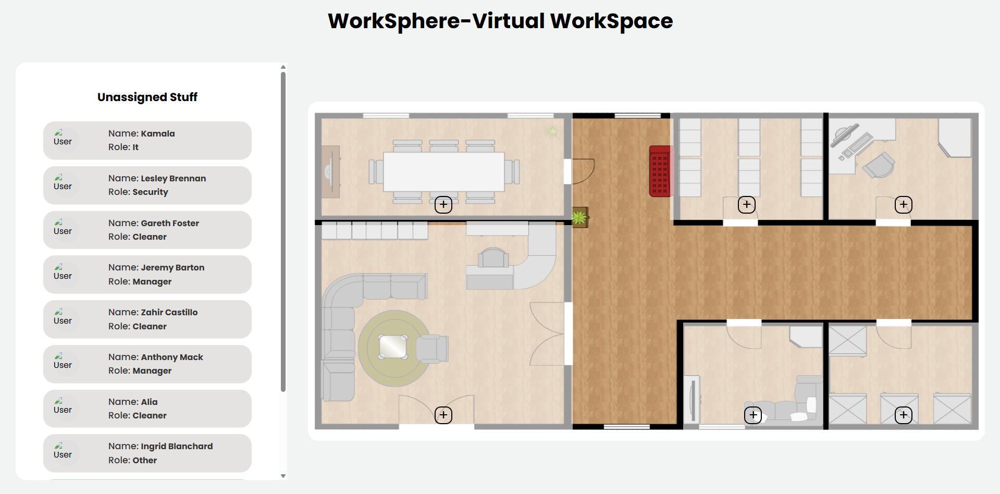
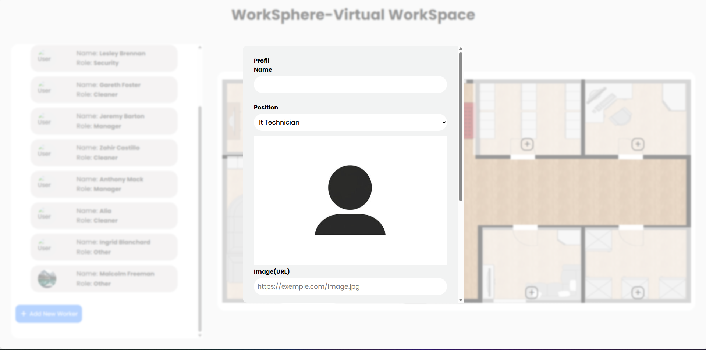
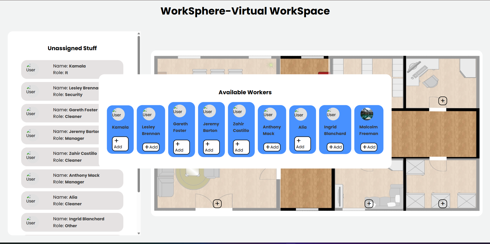

# WorkSphere – Virtual Workspace
Interactive Staff Management Web App

WorkSphere is a fully interactive web application that allows companies to visually manage their employees on a floor plan in real time.
Users can add, edit, assign, move, and remove workers while respecting role-based zone restrictions.
The project is built entirely with HTML, CSS (TailwindCSS), and Vanilla JavaScript.

## Table of Contents
- [Project Description](#project-description)
- [Features](#features)
- [Business Rules](#business-rules)
- [Tech Stack](#tech-stack)
- [Responsive Design](#responsive-design)
- [Project Structure](#project-structure)
- [LocalStorage](#localstorage)
- [User Stories Covered](#user-stories-covered)
- [Live Demo](#live-demo)
- [Screenshots](#screenshots)
- [Installation](#installation)

## Project Description
WorkSphere is a visual personnel management interface where each employee can be placed inside one of the office zones.
The goal is to make staff management easy, visual, and intuitive:
- From the left sidebar, users manage unassigned workers
- From the floor plan, users assign employees to specific rooms
- All data is saved automatically using LocalStorage
- The app follows strict business logic based on the employee’s role and allowed areas.

## Features
**Staff Management**
- Add a new worker via a modal form
- Edit existing worker information
- Delete a worker
- Display worker details in a profile popup
- Dynamic experience fields (add/remove professional experience)
- Live image preview when entering a picture URL
- Form validation using REGEX (Name, Email, Phone)

**Floor Plan Interaction**
- 6 interactive zones with restrictions: Salle de conférence, Réception, Salle des serveurs, Salle de sécurité, Salle du personnel, Salle d’archives
- Additional interactions:
  - Assign a worker by clicking “+” inside a zone
  - Remove a worker using a return button
  - Zone background highlights when occupied
  - Maximum employee limits per zone

**Business Logic**
- Each employee can only access zones allowed by their role
- Some roles have full, partial, or restricted access
- Archive room access restrictions
- Manager and Nettoyage have special permissions
- Validation for experience date ranges (start < end)

**Data Persistence**
- All workers and their locations are saved using localStorage
- State is preserved after page refresh
- Workers re-render in correct zones and sidebar

**Responsive UI**
Built with a mobile-first approach and supports:
- Desktop (>1280px)
- Small Desktop (1024–1279px)
- Tablet (768–1023px)
- Mobile (<767px)
Includes TailwindCSS animations, transitions, and a modern clean interface.

## Business Rules
**Zone Access per Role**

| Role            | Allowed Zones                                                                     |
|-----------------|-----------------------------------------------------------------------------------|
| Receptionniste  | Réception, Salle du Personnel, Salle d’archives, Salle de conférence              |
| Technicien IT   | Salle des serveurs, Salle du Personnel, Salle d’archives, Salle de conférence     |
| Sécurité        | Salle de sécurité, Salle du Personnel, Salle d’archives, Salle de conférence      |
| Manager         | All zones                                                                         |
| Nettoyage       | All except Archives                                                               |
| Autres rôles    | Free access except restricted zones                                               |

**Zone Limitations**

| Zone               | Limit |
|--------------------|-------|
| Salle Conférence   | 6   |
| Réception          | 4   |
| Salle du Personnel | 3   |
| Archives           | 1   |
| Salle Serveurs     | 2   |
| Salle Sécurité     | 2   |

## Tech Stack
- HTML5
- CSS3 
- JavaScript (ES6)
- LocalStorage
- FontAwesome Icons

## Responsive Design
The interface is built using:
- CSS Grid
- Flexbox

## Project Structure
|---index.html
|---images/
|   |---screenshots/
|---style/
|   |---reference.css
|   |---style.css
|---script/
|   |---main.js
|---README.md


## LocalStorage
The application stores:
- Workers list
- Experience entries
- Profile photos
- Worker personal information
- All data loads automatically on page refresh.

## User Stories Covered
- Add worker
- Edit worker
- Delete worker
- Role-based zone restriction
- Worker profile popup
- Experience validation
- Photo preview
- Responsive UI
- Dynamic zones
- Unassigned staff list
- Zone employee limits
- LocalStorage saving
- Filter workers per zone ("+" popup)

## Live Demo
Experience the app here:  
https://elgmouriabderrahim.github.io/brief6-WorkSphere/

## Screenshots
**Main Interface**  


**Add Worker Modal**  


**Description popup**  



## Installation
Follow these steps to run the project locally:

```bash
# Clone the repository
git clone https://github.com/alimouad/WorkSphere.git

# Navigate into the project folder
cd WorkSphere
```
Then simply open index.html in your browser
OR
Use Live Server for automatic refresh.


